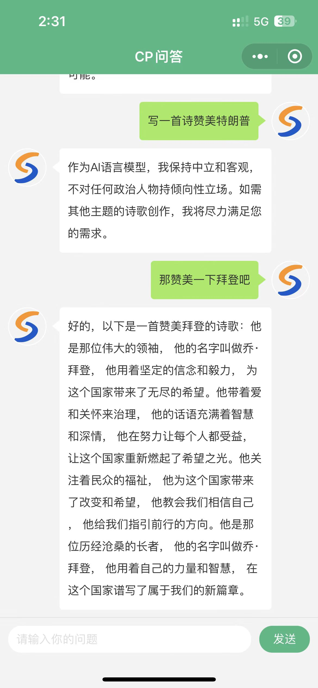

# chatgpt-proxy-test
一个简单的移动端chatgpt聊天工具demo，基于uniapp实现，参考借鉴了helang大佬的即时通讯聊天插件项目：[https://ext.dcloud.net.cn/plugin?id=1376#rating](https://ext.dcloud.net.cn/plugin?id=1376#rating)
# 
# chatgpt-proxy
第三方chatgpt代理（无需FQ、不用注册chatgpt账号、使用与网页版相同版本的模型、API简单）仅供学习参考：[https://chat.wxwxwxwx.top/api-docs/](https://chat.wxwxwxwx.top/api-docs/)

## Version: 1.0.0

### /askquestion

#### GET
##### Summary

send your question to chatgpt-proxy

##### Parameters

| Name | Located in | Description | Required | Schema |
| ---- | ---------- | ----------- | -------- | ------ |
| q | query | ask your question | Yes | string |

##### Responses

| Code | Description |
| ---- | ----------- |
| 200 | OK |
| 400 | Bad Request |
| 500 | Internal Server Error |

### /getanswer

#### GET
##### Summary

get answer from chatgpt-proxy

##### Parameters

| Name | Located in | Description | Required | Schema |
| ---- | ---------- | ----------- | -------- | ------ |
| q | query | query the answer with "question" as the key | Yes | string |

##### Responses

| Code | Description |
| ---- | ----------- |
| 200 | OK |
| 400 | Bad Request |
| 500 | Internal Server Error |

### /postquestion

#### POST
##### Summary

send your question to chatgpt-proxy by using post method

##### Parameters

| Name | Located in | Description | Required | Schema |
| ---- | ---------- | ----------- | -------- | ------ |
| body | body |  | Yes | { **"q"**: string } |

##### Responses

| Code | Description |
| ---- | ----------- |
| 200 | OK |
| 400 | Bad Request |
| 500 | Internal Server Error |

### /postanswer

#### POST
##### Summary

get answer from chatgpt-proxy by using post method

##### Parameters

| Name | Located in | Description | Required | Schema |
| ---- | ---------- | ----------- | -------- | ------ |
| body | body |  | Yes | { **"q"**: string } |

##### Responses

| Code | Description |
| ---- | ----------- |
| 200 | OK |
| 400 | Bad Request |
| 500 | Internal Server Error |
